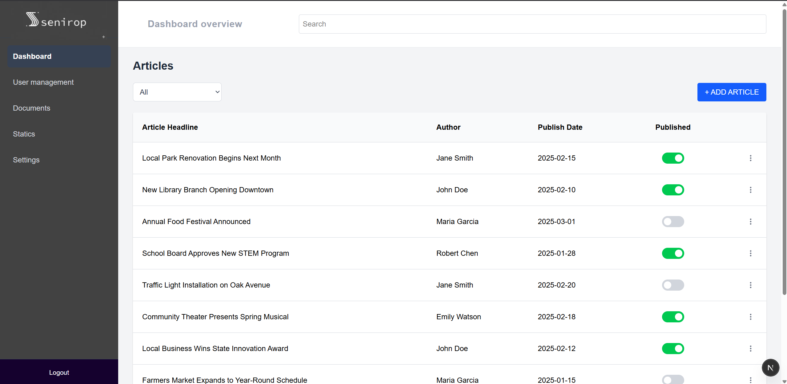
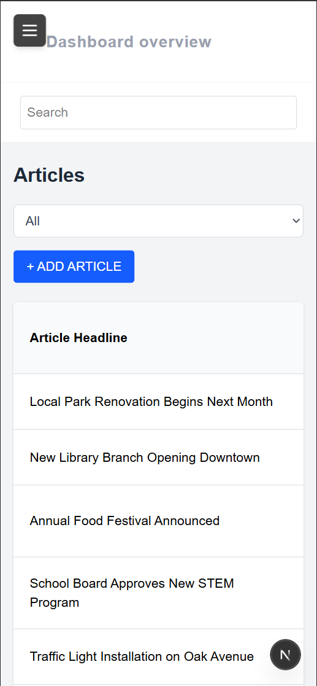

# Local Newspaper CMS - Demo
  


## Preview
#### Desktop version


#### Mobile version


<hr>

## Table of Contents

- [Description](#description)
- [Built With](#built-with)
- [Live Demo](#live-demo)
- [Folder Structure & Atomic Design](#folder-structure--atomic-design)
- [Code Documentation & Logic](#code-documentation--logic)
- [Deployment Guide](#deployment-guide)
- [Testing](#testing)
- [Collaborators](#collaborators)
<hr>

## Description
> This project is a modern, responsive Content Management System (CMS) dashboard built for the "Locals Newspaper" technical test. It allows users to view, search, filter, paginate, create, edit, and delete articles using an intuitive interface matching the provided Figma mockups.
<hr>

## Built With
* **Next.js (App Router):** Chosen for its robust architecture, built-in optimizations (like `<Image>` and routing), and seamless transition between Server and Client Components.
* **TypeScript:** Implemented to ensure type safety, reduce runtime errors, and provide better developer experience and self-documenting code through interfaces (e.g., `Article`).
* **Tailwind CSS:** Selected for rapid UI development. It allowed for pixel-perfect matching with the Figma designs while easily handling responsiveness (`md:`, `sm:` prefixes) without leaving the component files.
<hr>

## Live Demo

Check this [Live Demo](https://budget-app.fly.dev/) of the page.

<hr>

## Folder Structure & Atomic Design
The project strictly follows the **Atomic Design methodology** to ensure high reusability, maintainability, and Separation of Concerns (SoC).
* `src/components/atoms/`: The smallest building blocks (e.g., `Button`, `SearchInput`, `ToggleSwitch`). They are stateless and highly reusable.
* `src/components/molecules/`: Combinations of atoms forming relatively simple UI components (e.g., `ActionMenu`, `TablePagination`).
* `src/components/organisms/`: Complex UI sections built from atoms and molecules (e.g., `AsidePanel`, `Header`, `Sidebar`).
* `src/data/`: Contains static and in-memory data (`initialArticle.ts`, `menuItems.ts`) separated from UI logic.
* `src/types/`: Centralized TypeScript interfaces.

<hr>

## Code Documentation & Logic

### Overview
The main dashboard logic lives in `src/app/page.tsx` (or `src/app/dashboard/page.tsx`). It acts as the "smart" container that manages the global state (articles list, search text, current filter, and pagination) and passes data down to "dumb" components via props.

### Data Storage
As per the requirements, this project uses **In-Memory Storage**. The initial dataset is loaded from `src/data/initialArticle.ts`. All CRUD operations (Create, Update, Delete, Toggle Publish) manipulate the React state (`useState`) directly. Refreshing the page will reset the data to its initial state.

### Non-Obvious Logic & Highlights
* **Dynamic Form Validation (`AsidePanel.tsx`):** The "Save" button is dynamically disabled. A computed boolean (`formIsValid`) checks that no mandatory fields are empty and that the date is valid. Only when true, the button changes color and becomes clickable.
* **Smart Pagination Reset:** A `useEffect` hook listens to `searchText` and `filter` changes. If the user searches or filters, the pagination automatically forces the user back to `Page 1` to prevent them from being stuck on an empty page if the filtered results are fewer than the current offset.
* **Click-Outside Detection:** The `ActionMenu` (three dots) uses a custom `useRef` and `useEffect` combo tied to a `mousedown` event listener to close the dropdown automatically when the user clicks anywhere else on the screen, mimicking native OS behavior.

<hr>

## Deployment Guide

### Prerequisites
* Node.js (v18 or higher)
* npm, yarn, or pnpm installed

### Local Development Setup
1. Clone the repository to your local machine:
   ```bash
   git clone https://github.com/fherrerao/local_newspaper_CMS.git
   ```
2. Navigate to the project directory:
   ```bash
   cd local_newspaper_CMS
   ```
3. Install dependencies:
   ```bash
   npm install
   ```
4. Run the development server:
   ```bash
   npm run dev
   ```
5. Open http://localhost:3000 with your browser to see the result.

<hr>

## Testing
This project uses Jest and React Testing Library to ensure business logic and UI integrity.

### Test Environment Setup
The project is configured with `@testing-library/jest-dom` via a global `jest.setup.ts` file, and uses the `next/jest` compiler to properly handle Next.js environment variables.

### Running Tests
To run the test suite, execute the following command:
   ```bash
   npm run test
   ```

<hr>

## Collaborators

👤 **Fernando Herrera**

| Platform | Badge |
| :--- | :--- |
| **GitHub** | [@fherrerao](https://github.com/fherrerao) |
| **Twitter** | [Fernando Herrera](https://twitter.com/fherrera0206) |
| **LinkedIn** | [Fernando Herrera](https://www.linkedin.com/in/fherrerao/) |

<hr>
